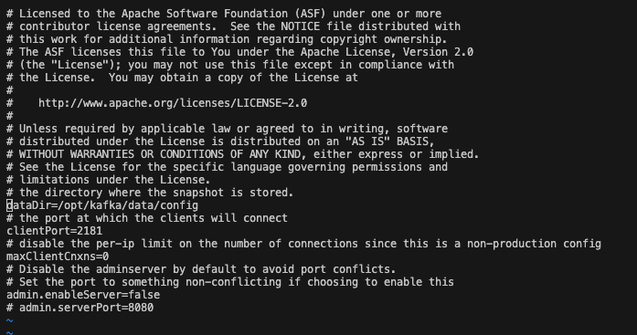
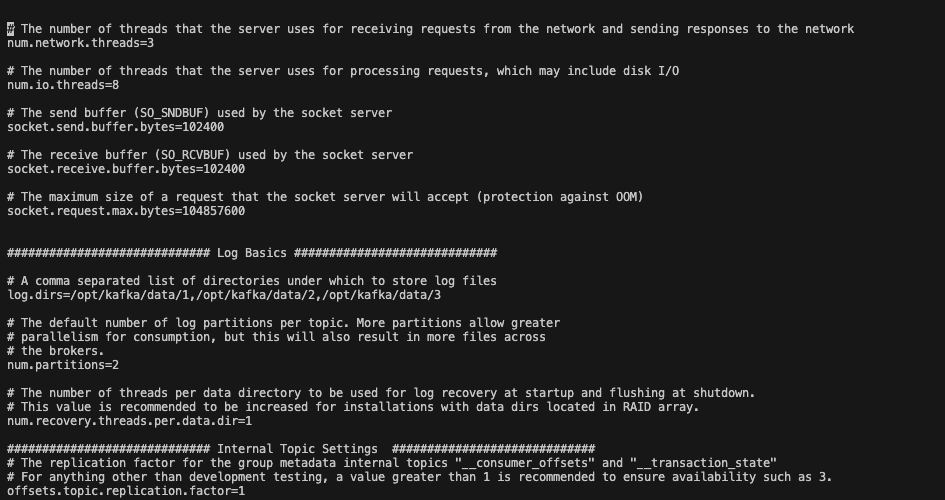
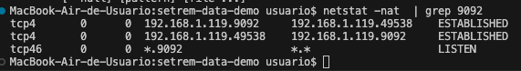
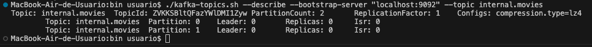
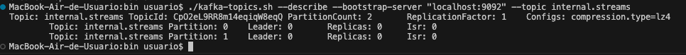
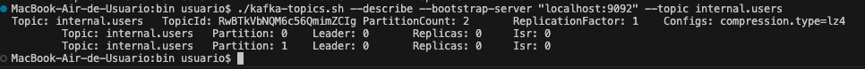

# KAFKA

## Index
- [Installation](#installation)
- [Inicialization](#inicialization)
- [Creating the topics](#creating-the-topics)

## Installation
- Download: https://kafka.apache.org/downloads
- Kafka 3.5.1 com Scala 2.12
- My Kafka was installed on ```/opt/kafka/```

## Inicialization
- Changing the config file for Zookeeper: ```vi /opt/kafka/config/zookeeper.properties```

You must change the ```dataDir``` config.

> It must represents the folder to be the "storage" of Zookeeper. Where to save persistent data.



- Changing the config file for Kafka server: ```vi /opt/kafka/config/server.properties```

You can change anything here, but, for our tutorial we'll change just the ```log.dirs```` config.

> You can put multiple folders here separated by comma.



- Now, you basically needed to start the Zookeeper and Kafka Server (in this order).

Zookeeper:
```sh
cd /opt/kafka/bin
./zookeeper-server-start.sh ../config/zookeeper.properties
```

In a different session, start Kafka server:
```sh
cd /opt/kafka/bin
./kafka-server-start.sh ../config/server.properties
```

Now, Kafka server should be running on port 9092.



> If it doesn't work, please [check this documentation](https://kafka.apache.org/quickstart) for more details.

## Creating the topics

In this tutorial, we'll be using Kafka just for the __internal data__. So, we need three differents topics:
- internal.movies
- internal.streams
- internal.users

> We'll be using the Shell Scripts provided by Kafka to create this topics.

__internal.movies__
```sh
cd /opt/kafka/bin
./kafka-topics.sh --create --partitions 2 --config "compression.type=lz4" --bootstrap-server "localhost:9092" --topic internal.movies
```



__internal.streams__
```sh
cd /opt/kafka/bin
./kafka-topics.sh --create --partitions 2 --config "compression.type=lz4" --bootstrap-server "localhost:9092" --topic internal.streams
```



__internal.users__
```sh
cd /opt/kafka/bin
./kafka-topics.sh --create --partitions 2 --config "compression.type=lz4" --bootstrap-server "localhost:9092" --topic internal.users
```


