# setrem-data-demo
Data activity to simulate the use of Spark and Kafka for a simple data injestion.

This tutorial is organize is two parts:
- In the first one, we use a folder on the OS to be the datalake. Here we use just Spark for data injestion and extraction.
- In the second part, we use Kafka as datalake for the internal data.

## Index
- [Environment](#environment)
- [First part - Using Spark](#first-part---using-spark)
    - [Data injestion](#data-injestion)
        - [Internal raw data](#internal-raw-data)
        - [External raw data](#external-raw-data)
    - [Data reading](#data-reading)
        - [Query 1](#query-1)
        - [Query 2](#query-2)
- [Second part - Using Kafka](#second-part---using-kafka)
    - [Writing data on Kafka](#writing-data-on-kafka)
        - [Importing movies.csv](#importing-moviescsv)
        - [Importing streams.csv](#importing-streamscsv)
        - [Importing users.csv](#importing-userscsv)
    - [Reading data from Kafka](#reading-data-from-kafkas)

## Environment
Here are some considerations about the enviroment and the tools that I used.

- Host machine: MacBook.
- Basic requirements:
    - The current Java version is 1.8.0_411.
- Spark:
    - Download: [https://spark.apache.org/downloads.html](https://spark.apache.org/downloads.html)
    - The spark version is 3.5.1.
    - The scala version is 2.12.18.
    - Spark was installed on ```/opt/spark/```
- Kafka:
    - Download: [https://kafka.apache.org/downloads](https://kafka.apache.org/downloads)
    - Kafka 3.5.1 com Scala 2.12
    - Kafka was installed on ```/opt/kafka/```

## First part - Using Spark

### Data injestion
Once we have the environment and the tools configured, we should create a datalake, put some raw data in it and then import, refine and save this refined data.

The raw data will be in ```csv``` or ```json``` format, and the refined data will be in ```parquet``` format.

Here, you need to create a folder in your machine to be the datalake, a simple example could be:
```sh
cd /tmp
mkdir -p datalake/raw/external datalake/raw/internal datalake/refined/batch datalake/refined/stream
```

Then you must copy the content of the folder ```datalake/raw```, present in this this repository, to you target datalake. In this tutorial, we are using ```/tmp/datalake/```.

Your datalake structure may look like this:

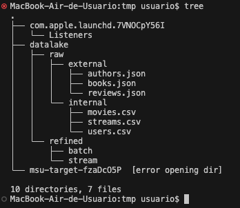

Then, you must define an environment variable with the full path of your datalake. This will be used in the next steps inside ```spark shell```.

```sh
export DATALAKE_PATH="/tmp/datalake" 
```

Starting SparkShell:
```sh
cd /opt/spark/bin
./spark-shell --master="local[2]"
```

> Where "local[2]" represents your local machine and the number of vCores that Spark will be using

> /opt/spark/ represents the location where Spark was installed.

On Spark Shell...

Loading the env var:
```sh
val DATALAKE_PATH = sys.env("DATALAKE_PATH")
```

To validate if it has value, just run:

```sh
print(DATALAKE_PATH)
```

#### Internal raw data
Considerations:
- All the commands here are performed using Spark shell (using the Scala interpreter).
- The internal data are using ```csv``` format.
- The internal data must be appended, so, if you run the commands in Spark multiple times, the output data will be appended.
- Before saving the content as parquet, we must convert the INT, DECIMAL and TIMESTAMP fields.

The raw data to be injected are here:
- [movies.csv](./datalake/raw/internal/movies.csv): Available movies on the app.
- [streams.csv](./datalake/raw/internal/streams.csv): Historical data from December 2021 about streaming movie activities.
- [users.csv](./datalake/raw/internal/users.csv): Active users on the app.

Importing ```movies.csv```, converting the data and saving it as parquet on the ```refined``` folder:
```sh
val df_movies_1 = spark.read.format("csv").option("header", "true").load(DATALAKE_PATH + "/raw/internal/movies.csv")
df_movies_1.printSchema

val df_movies_2 = df_movies_1.selectExpr("title", "cast(duration_mins as int) as duration_mins", "original_language", "cast(size_mb as decimal(8,2)) as size_mb")
df_movies_2.printSchema

df_movies_2.write.format("parquet").mode("append").save(DATALAKE_PATH + "/refined/stream/movies.parquet")
```

It should have 91 lines here
```sh
df_movies_1.count
```


Importing ```users.csv```, converting the data and saving it as parquet on the ```refined``` folder:
```sh
val df_users = spark.read.format("csv").option("header", "true").load(DATALAKE_PATH + "/raw/internal/users.csv")
df_users.printSchema

df_users.write.format("parquet").mode("append").save(DATALAKE_PATH + "/refined/stream/users.parquet")
```

It should have 783 lines here
```sh
df_users.count
```

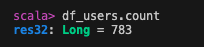

Importing ```streams.csv```, converting the data and saving it as parquet on the ```refined``` folder:
```sh
val df_streams_1 = spark.read.format("csv").option("header", "true").load(DATALAKE_PATH + "/raw/internal/streams.csv")
df_streams_1.printSchema

val df_streams_2 = df_streams_1.selectExpr("movie_title", "user_email", "cast(size_mb as decimal(8,2)) as size_mb", "cast(start_at as timestamp)", "cast(end_at as timestamp)")
df_streams_2.write.format("parquet").mode("append").save(DATALAKE_PATH + "/refined/streams/stream.parquet")
```

It should have 9,652 lines here
```sh
df_streams_2.count
```

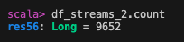

At the end, you should have a content similar to this on the ```refined/stream``` folder on the datalake:

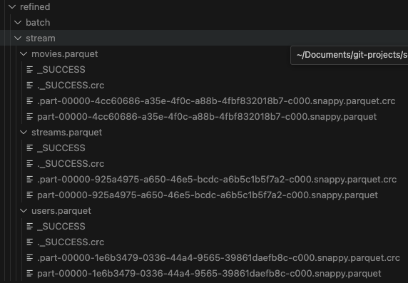

> Note that we are using the word "stream" here, but in fact the data was loaded as batch and not stream.

#### External raw data
Considerations:
- All the commands here are performed using Spark shell (using the Scala interpreter).
- The external raw data are using ```json``` format.
- The external raw data must be OVERWRITED, so, if you run the commands in Spark multiple times, the output will be always the same.
- Before saving the content as parquet, we must convert the INT, DECIMAL and TIMESTAMP fields.

The raw external data to be injected are here:
- [authors.json](./datalake/raw/external/authors.json): Information about famous authors.
- [books.json](./datalake/raw/external/books.json): Famous books.
- [reviews.json](./datalake/raw/external/reviews.json): Reviews from movies based on books.

Importing ```authors.json```, converting the data and saving it as parquet on the ```refined``` folder:
```sh
val df_authors_1 = spark.read.format("json").load(DATALAKE_PATH + "/raw/external/authors.json")
df_authors_1.printSchema

val df_authors_2 = df_authors_1.selectExpr("cast(birth_date as timestamp) as birth_date", "cast(died_at as timestamp) as died_at", "name", "nationality")
df_authors_2.write.format("parquet").mode("overwrite").save(DATALAKE_PATH + "/refined/batch/authors.parquet")
````

It should have 200 lines here
```sh
df_authors_2.count
```

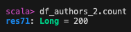

Importing ```books.json```, converting the data and saving it as parquet on the ```refined``` folder:
```sh
val df_books_1 = spark.read.format("json").load(DATALAKE_PATH + "/raw/external/books.json")
df_books_1.printSchema

val df_books_2 = df_books_1.selectExpr("author", "name", "cast(pages as int) as pages", "publisher")
df_books_2.printSchema

df_books_2.write.format("parquet").mode("overwrite").save(DATALAKE_PATH + "/refined/batch/books.parquet")
````

It should have 103 lines here
```sh
df_books_2.count
```

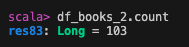

Importing ```reviews.json```, converting the data and saving it as parquet on the ```refined``` folder:
```sh
val df_reviews_1 = spark.read.format("json").load(DATALAKE_PATH + "/raw/external/reviews.json")
df_reviews_1.printSchema

val df_reviews_2 = df_reviews_1.selectExpr("book", "movie", "cast(rate as int) as rate", "resume")
df_reviews_2.printSchema

df_reviews_2.write.format("parquet").mode("overwrite").save(DATALAKE_PATH + "/refined/batch/reviews.parquet")
````

It should have 501 lines here
```sh
df_reviews_2.count
```

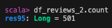

At the end, you should have a content similar to this on the ```refined/batch``` folder on the datalake:

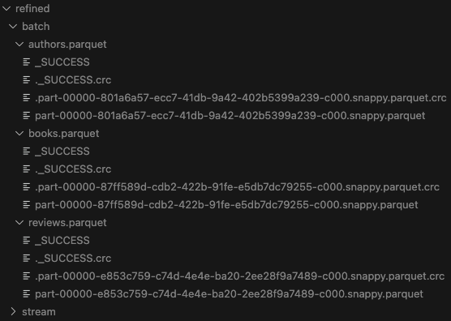

### Data reading
We can use two queries within Spark Shell to validate if the data injestion was performed correctly.

#### Query 1

It gets the percentage of watched movies which are based on books.

Query:
```sql
SELECT
    Count_if(r.movie IS NOT NULL) streams_based_books_tot,
    Count(*) streams_tot,
    Count_if(r.movie IS NOT NULL) / Count(*) books_based_perc
FROM internal_streams s
LEFT JOIN (
        SELECT movie FROM external_reviews GROUP BY movie
) AS r ON ( s.movie_title = r.movie )
````

Using Spark Shell:
```sh
val internal_streams = spark.read.format("parquet").load(DATALAKE_PATH + "/refined/stream/streams.parquet")
internal_streams.createOrReplaceTempView("internal_streams")

val external_reviews = spark.read.format("parquet").load(DATALAKE_PATH + "/refined/batch/reviews.parquet")
external_reviews.createOrReplaceTempView("external_reviews")

val query_1 = spark.sql(
"""SELECT Count_if(r.movie IS NOT NULL) streams_based_books_tot, Count(*) streams_tot, Count_if(r.movie IS NOT NULL) / Count(*) books_based_perc FROM internal_streams s LEFT JOIN(SELECT movie FROM external_reviews GROUP BY movie) AS r ON ( s.movie_title = r.movie )""".stripMargin)
query_1.show(false)
```

Expected result:

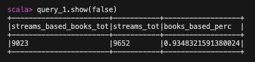


#### Query 2

It gets the amount of movies based on books written by authors from Singapore that was watched in December 2021.

Query:
```sql
SELECT count(DISTINCT s.movie_title, s.user_email, s.size_mb, s.start_at, s.end_at) movie_streamed_tot
FROM external_authors a
INNER JOIN external_books b ON (a.name = b.author)
INNER JOIN external_reviews r ON (b.name = r.book)
INNER JOIN internal_streams s ON (s.movie_title = r.movie)
WHERE a.nationality = 'Singaporeans'
```

Using Spark Shell:
```sh
val external_authors = spark.read.format("parquet").load(DATALAKE_PATH + "/refined/batch/authors.parquet")
external_authors.createOrReplaceTempView("external_authors")

val external_books = spark.read.format("parquet").load(DATALAKE_PATH + "/refined/batch/books.parquet")
external_books.createOrReplaceTempView("external_books")

val external_reviews = spark.read.format("parquet").load(DATALAKE_PATH + "/refined/batch/reviews.parquet")
external_reviews.createOrReplaceTempView("external_reviews")

val internal_streams = spark.read.format("parquet").load(DATALAKE_PATH + "/refined/stream/streams.parquet")
internal_streams.createOrReplaceTempView("internal_streams")

val query_2 = spark.sql("""SELECT count(DISTINCT s.movie_title, s.user_email, s.size_mb, s.start_at, s.end_at) movie_streamed_tot FROM external_authors a INNER JOIN external_books b ON (a.name = b.author) INNER JOIN external_reviews r ON (b.name = r.book) INNER JOIN internal_streams s ON (s.movie_title = r.movie) WHERE a.nationality = 'Singaporeans'""".stripMargin)
query_2.show(false)
```

Expected result:

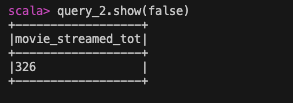

## Second part - Using Kafka

> Before actually use Kafka, __we must install and configure it__. To do that just [follow this tutorial here](KAFKA.md).

### Writing data on Kafka

Starting Spark Shell

First of all, remember to again define the DATALAKE_PATH environment variable and import it on Spark Shell.

```sh
cd /opt/spark/bin
./spark-shell --master "local[2]" --packages org.apache.spark:spark-sql-kafka-0-10_2.12:3.5.1
```

> Note that here we must initialize a package to be using Kafka

#### Importing movies.csv

We must read the file ```${DATALAKE_PATH}/raw/internal/movies.csv```, convert it to JSON and then save it on Spark topic ```internal.movies```:

```
val df_movies = spark.read.format("csv").option("header", "true").load(DATALAKE_PATH + "/raw/internal/movies.csv")
df_movies.printSchema
val json = df_movies.toJSON
json.write.format("kafka").option("kafka.bootstrap.servers", "localhost:9092").option("compression", "lz4").option("topic", "internal.movies").save
```

#### Importing streams.csv

We must read the file ```${DATALAKE_PATH}/raw/internal/streams.csv```, convert it to JSON and then save it on Spark topic ```internal.streams```:

```
val df_streams = spark.read.format("csv").option("header", "true").load(DATALAKE_PATH + "/raw/internal/streams.csv")
df_streams.printSchema
val json = df_streams.toJSON
json.write.format("kafka").option("kafka.bootstrap.servers", "localhost:9092").option("compression", "lz4").option("topic", "internal.streams").save
```

#### Importing users.csv

We must read the file ```${DATALAKE_PATH}/raw/internal/users.csv```, convert it to JSON and then save it on Spark topic ```internal.users```:

```
val df_users = spark.read.format("csv").option("header", "true").load(DATALAKE_PATH + "/raw/internal/users.csv")
df_users.printSchema
val json = df_users.toJSON
json.write.format("kafka").option("kafka.bootstrap.servers", "localhost:9092").option("compression", "lz4").option("topic", "internal.users").save
```

### Reading data from Kafka

Here we are using a simple example of reading data from the __internal.streams__ topic on Kafka:

```
val test = spark.read.format("kafka").option("kafka.bootstrap.servers", "localhost:9092").option("subscribe", "internal.streams").load
test.printSchema
test.count
```

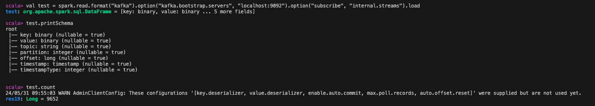
